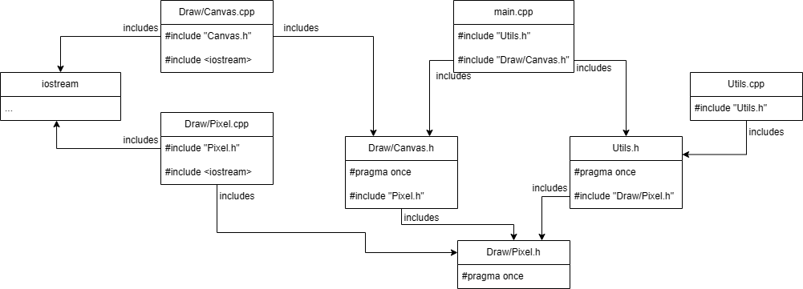
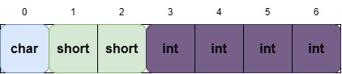
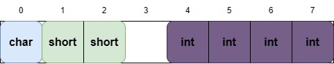
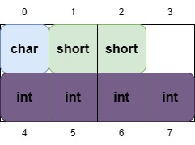
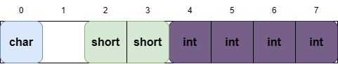
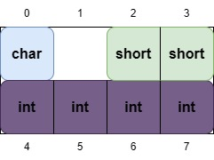
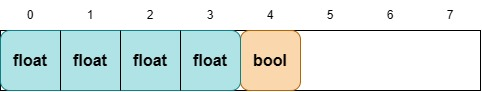
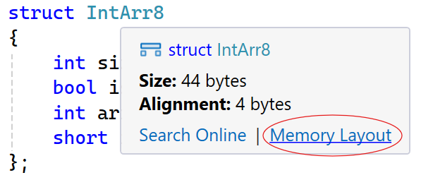
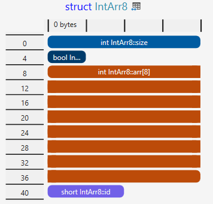

# Структури, оператори за достъп, разделна компилация, представяне в паметта на структурите

1. [Структури](#structs)
2. [Оператори за достъп](#operators)
3. [Разделна компилация](#compilation)
4. [Представяне в паметта на структурите](#structs-size)

## Структури <a name="structs"></a>
Структурите в С++ ни позволяват да създадем нов сложен тип, като го представим като комбинация от отделните му компоненти. Най-общо казано, може да мислим структурите като начин за пакетиране на няколко променливи от произволни типове в една обща единица.

Например, един пиксел се състои от 3 канала - Red, Green, Blue; всеки един от тези канали има целочислена стойност. В контекста на структурата, отделнтие компоненти се наричат *полета*. За да опишем един пиксел, пишем следната структура:

```cpp
struct Pixel
{
    int red;
    int green;
    int blue;
};
```

### Създаване на инстанции

Сега вече имаме "скелета" на един пиксел. За да го използваме, трябва да създадем *инстанция* на тази структура. Това става по същия начин, както с нормалните променливи:

```cpp
Pixel pixel;
```

Инстанциите на една структура(и по-нататък `class`) ще наричаме обекти. В този случай `pixel` е обект от тип `Pixel`.

> Важно: Правилата на езика си важат и всички компоненти на `pixel` ще имат някакви произволни стойности

Сега вече много по-лесно можем да създаваме и управляваме обекти. Можем дори да правим масиви, например ако искаме да направим платно от 1280х720 пиксела, пишем следното:

```cpp
Pixel canvas[1280][720];
```

---

За да зададем някакви стойности на този пиксел, можем да подходим по няколко начина. Първият е след като създадем *обекта*, чрез оператора `.`, който служи за *достъп* на отделните *полета* в структурата (red, green, blue).

```cpp
Pixel pixel;

pixel.red = 255;
pixel.green = 0;
pixel.blue = 255;
```

Друг вариант е още докато го създаваме, с помощта на къдрави скоби `{}` да въведем съответните стойности. Въвеждането на стойностите следва реда на деклариране на полетата в структурата.

```cpp
//           r    g    b
Pixel pixel {255, 0, 255};
```

Можем и да създадем обект, който задава стойностите по подразбиране на всички компоненти в него.

```cpp
Pixel pixel {};
// pixel.red == pixel.green == pixel.blue == 0
```

Сега вече всички полета ще съдържат техните стойности по подразбиране. В случая на `int` - `0`.

> Този начин е официално към стандарта от C++23, но e имплементиран от всеки известен компилатор включително MSVC, който идва с Visual Studio


### Подаване на обекти във функции
---

Обекти можем да подаваме на функции, както нормални променливи. Например, за да напишем функция, която принтира стойностите на един пиксел:

```cpp
void printPixelInfo(Pixel pixel)
{
    std::cout << "R: " << pixel.red << std::endl;
    std::cout << "G: " << pixel.green << std::endl;
    std::cout << "B: " << pixel.blue << std::endl;
}

int main()
{
    Pixel pixel {255, 0, 255};

    printPixelInfo(pixel);
}
```

Обектите, както нормалните променливи, се подават като **копие**. Това означава, че ако искаме да напишем функция, която увеличава яркостта на пиксела, и подадем обектът по копие, няма да има отразена промяна в оригиналния обект. За това подаваме по референция.

```cpp
void increaseBrightnessWrong(Pixel pixel, int amount)
{
    pixel.red += amount;
    pixel.green += amount;
    pixel.blue += amount;
}

void increaseBrightnessCorrect(Pixel& pixel, int amount)
{
    pixel.red += amount;
    pixel.green += amount;
    pixel.blue += amount;
}

int main()
{
    Pixel pixel {100, 0, 100};

    increaseBrightnessWrong(pixel, 100);
    printPixelInfo(pixel);

    std::cout << "\n\n";

    increaseBrightnessRight(pixel, 100);
    printPixelInfo(pixel);
}

```

```
R: 100
G: 0
B: 100

R: 200
G: 100
B: 200
```

---

**Теорията за размерът на една структура ще обсъдим по-надолу в този документ.**  

В момента структурата `Pixel` има размер `12 bytes`. Това означава, че когато подадем обект към функция по копие, програмата трябва да копира тези 12 байта, да създаде нов обект, и чак тогава да може да се използва във функцията. Сега ще кажете, че 12 байта не са чак толкова много, но какво ще стане ако структурата е с големина 96 байта, ами 196 байта и т.н.  

Вместо да правим ненужни копия на обекта, ние можем да го подадем по референция. Това означава, че когато няма да правим промени по обекта и искаме само да достъпим неговите данни без да ги променяме, трябва да подадем обекта по константна референция. По този начин копираме само адреса на обекта (8 байта при 64-bit и 4 байта при 32-bit), 

```cpp
void printPixelInfoCorret(const Pixel& pixel)
{
    std::cout << "R: " << pixel.red << std::endl;
    std::cout << "G: " << pixel.green << std::endl;
    std::cout << "B: " << pixel.blue << std::endl;
}
```

> Добре де, а кога тогава да подаваме по копие?

В общия случай може да се водите по следното:
- По копие -> Когато очаквате да промените обекта във функцията, но не искате промените да "излязат" извън самата функция
- По референция -> Когато искате да направите промяна по обекта, но и искате промените да "излязат" извън самата функция
- По константна референция -> Когато искате само да достъпите полетата на обекта без да ги променяте.

Примери:

```cpp

Pixel createDoubleBrightness(Pixel pixel) // Пример за подаване по копие
{
    pixel.red *= 2;
    pixel.green *= 2;
    pixel.blue *= 2;

    return pixel;
}

void increaseBrightness(Pixel& pixel, int amount) // Пример за подаване по референция
{
    pixel.red += amount;
    pixel.green += amount;
    pixel.blue += amount;
}

void printPixel(const Pixel& pixel) // Приемр за подаване по константа референция
{
    std::cout << "R: " << pixel.red << std::endl;
    std::cout << "G: " << pixel.green << std::endl;
    std::cout << "B: " << pixel.blue << std::endl;
}

```

---

Виждаме, че в такъв тип функции, в които искаме да използваме обекта, винаги трябва да го подаваме като  параметър. В такива случаи е по-удобно да напишем функцията вътре в структурата. Такава функция се нарича *метод*. В методите се приема, че работим със специфична инстанция на структурата, следователно нямаме частта `pixel.` а работим директно с полетата.

> ВАЖНО: Разглеждаме описването на методи в структури единствено за да може по-лесно да преминем към работа с файлове. В този етап на курса е препоръчително (дори задължително) да се придържате към горе описаният начин на работа със структури. Тоест функциите да приемат обекта и да вършат някаква работа с него. Когато вземем класове, ще можем да използваме методи и ще се запознаем с всички тънкости свъразни с тях.

```cpp
struct Pixel
{
    int red;
    int green;
    int blue;

    void printInfo()
    {
        std::cout << "R: " << red << std::endl;
        std::cout << "G: " << green << std::endl;
        std::cout << "B: " << blue << std::endl;
    }

    void increaseBrightness(int amount)
    {
        red += amount;
        green += amount;
        blue += amount;
    }
};
```

```cpp
int main()
{
    Pixel pixel {100, 0, 50};

    pixel.increaseBrightness(100);
    pixel.printInfo();
}
```

```
R: 200
G: 100
B: 150
```

### Влагане на обекти
Можем и без проблем да влагаме обекти в структури.

```cpp
#include <iostream>

struct Pixel
{
    int red;
    int green;
    int blue;
};

struct NamedPixelPair
{
    char name[1024];
    Pixel firstPixel;
    Pixel secondPixel;
}

int main()
{
    NamedPixelPair namedPP = { "Red-Blue", { 255, 0, 0}, { 0, 0, 255 } };

    std::cout << namedPP.name << "\n";
    std::cout << "First pixel's first channel value: " << namedPP.red;
}
```

### Създаване на динамични обекти
Можем да създаваме динамични обекти по същия начин по който създаваме динамични променливи.

```cpp
#include <iostream>

struct Pixel
{
    int red;
    int green;
    int blue;
};

int main()
{
    Pixel* dynamicPixel = new Pixel{255, 255, 255};
    std::cout << "Red: " << dynamicPixel->red << "\n";
    std::cout << "Green: " << dynamicPixel->green << "\n";
    std::cout << "Blue: " << dynamicPixel->blue << std::endl;
}
```

Забележете, че тук достъпваме елементите с оператора `->`, вместо с оператора `.`. Когато работим с указатели на обекти, то тогава ние достъпваме елемнтите на обекта чрез оператора `->`. Той е аналогичен на следното `(*dynamicPixel).red`. Тоест оператора `->` първо дереференцира указателя към обекта и след това достъпва някой от неговите полета.

## Оператори за достъп <a name="operators"></a>

В общия случай в `C++` разползагаме с три основни оператора за достъпа, а те са `::`(`Scope resolution`), `.`(`Pointer to member` или `Dot`), `->`(`Pointer to member`).

`::`(`Scope resolution`) се използва тогава, когато достъпваме елемент от някоя логическа структура, която не е обект(няма инстанция). Пример за такава логическа структура е един `enum` или `enum class`.

Нека имаме следното:
```cpp
enum class Color 
{
    RED,
    GREEN,
    BLUE
};

int main()
{
    Color::RED;             // Correct
    Color c = Color::GREEN; // Correct
    c::Blue;                // Error
}
```

Тук използваме оператора `::` за да достъпим елемент директно от `Color`, което е тип и не е обект. Ако се опитаме да достъпим някой елемент от обекта `c` с оператора `::`, ще получим грешка.  
Друг познат пример е `std::cout`. Тук `std` играе роля на т.нар `namespace`. Не е важно на този етап да знаете какво е `namespace`. На кратко идеята му е да раздели кода логически, като предостави общо име за група функционалности. В този случай `namespace`-ът `std` се използва за фунцкионалности и типове от стандартната библиотека на езика. `std` не е обект и затова всички функционалности, типове, структури и класове се достъпват с оператора `::`.

`.`(`Pointer to member` or `Dot`) се използва, когато достъпваме елементи на даден обект(инстанция) на структура или клас. По-горе са посочени множество примери, които показват примери за този оператор.

`->`(`Pointer to member`) има абсолютно същата функционалност както `.` оператора, но `->` се използва тогава когато се достъпват елементи на указатели към обекти. Следния синтаксис е аналогичен `dynamicPixel->red` <=> `(*dynamicPixel).red`.

Обобщение:
- `::` -> За достъпване на елементи съдържащи се в самите типове(ще стане много по-ясно по-късно в курса) и `namespace`-и  
- `.` -> За достъпване на полета в инстанции(обекти) на структури и класове
- `->` -> За достъпване на полета в указатели към инстанции(обекти) на структури и класове

## Разделна компилация <a name="compilation"></a>
Използваме `#include <iostream>` от самото начало, но за сега е било на принципа "прави се така защото трябва". `#include` е просто инструкция, която казва "вземи съдържанието на указания файл, и го постави тук".

С други думи можем да си отделим функциите в отделен текстови файл (типично `.h` или `.hpp`) и после да ги include-нем. 

Когато си създаваме собствени файлове, пишем `#include "file.h"`, а не `#include <file.h>`

**functions.h**
```cpp
int fib(int n)
{
    if (n == 1)
        return 1;
    if (n == 0)
        return 0;

    return fib(n - 1) + fib(n - 2);
}

void printFib(int n)
{
    std::cout << fib(n);
}
```

**main.cpp**
```cpp
#include <iostream>
#include "functions.h"

int main()
{
    printFib(8);
}
```

> functions.h е прост пример и не трябва да се използва в практиктата поради множество причини. Важното тук е да запомните, че #include копира цялто съдържание на един файл и го поставя на неговото място по време на компилация. Този файл може да е всякакъв, дори и file.txt

**myVar.txt**
```cpp
int externalVar = 128;
```

**main.cpp**
```cpp
#include <iostream>
#include "myVar.txt"

int main()
{
    std::cout << "External var is: " externalVar;
}
```

```
External var is: 128
```

---

**Разделната компилация** е процесът на разделяне на *декларация* и *дефиниция* в отделни файлове. Това става по следния начин:

- Декларациите отиват в `.h`/`.hpp` файл
- Дефинициите отиват в `.cpp` файл

Причините за да правим разделна компилация са няколко:
- В по-голям проект, всичко да е на един файл става трудно за управление  
- При разглеждане на кода е много по-лесно да се влезе в `.h` файла за да се види каква функционалност има, без много да се затрупваме от имплементацията.
- Компилират се само тези `.cpp` файлове, които са променени от последната компилация, т.е. разделната компилация води и до *по-бързо* компилиране

Пример:  

**Vector2D.h**
```cpp
#pragma once

struct Vector2D
{
    double x, y;
};

double dot(Vector2D a, Vector2D b);

double length(Vector2D vec);
```

**Vector2D.cpp**
```cpp
#include "Vector2D.h"
#include <cmath>

double dot(Vector2D a, Vector2D b)
{
    return a.x * b.x + a.y * b.y;
}

double length(Vector2D vec)
{
    return sqrt(vec.x * vec.x + vec.y * vec.y);
}
```

**main.cpp**

```cpp
#include <iostream>
#include "Vector2D.h"

int main()
{
    Vector2D vec1 {5, 10};
    Vector2D vec2 {2, -12};

    std::cout << dot(vec1, vec2) << '\n';
    std::cout << length(vec1);
}
```

Забележете във `Vector2D.h` има нещо ново, което е `#pragma once`.  
Това гарантира, че когато напишем `#include "Vector2D.h"`, съдържанието на този `header` файл, ще се копира и постави само веднъж. Какво означава това?  

Да кажем, че `main.cpp` изглежда по следния начин:

**main.cpp**

```cpp
#include <iostream>
#include "Vector2D.h"

#include "Vector2D.h"

int main()
{
    Vector2D vec1 {5, 10};
    Vector2D vec2 {2, -12};

    std::cout << dot(vec1, vec2) << '\n';
    std::cout << length(vec1);
}
```

То тогава ако `#pragma once` липсва от `Vector2D.h`, след компилация `main.cpp` ще изглежда по следния начин.

**main.cpp**

```cpp
#include <iostream>
struct Vector2D
{
    double x, y;
};

double dot(Vector2D a, Vector2D b);

double length(Vector2D vec);

struct Vector2D
{
    double x, y;
};

double dot(Vector2D a, Vector2D b);

double length(Vector2D vec);

int main()
{
    Vector2D vec1 {5, 10};
    Vector2D vec2 {2, -12};

    std::cout << dot(vec1, vec2) << '\n';
    std::cout << length(vec1);
}
```

Това ще доведе до компилационна грешка! Разбира се при такава малка програма е лесно да премахнем единия допълнителен `#include`, но при по-сложни програми това е невъзможно. Затова е важно всеки един `.h` или `.hpp` файл да започва с `#pragma once`. 

> Не е нужно да добавяме `#pragma once` при `.cpp` файловете. Това е така, защото `.cpp` файловете се обработват при самата компилация и тяхното съдражние не се копира за разлика от `.h` и `.hpp` файловете.

### Винаги към `.cpp` файла на даден `.h` файл include-ваме `.h` файла

По-интересен пример:

**Draw/Pixel.h**
```cpp
#pragma once

struct Pixel
{
	unsigned red = 0;
	unsigned green = 0;
	unsigned blue = 0;
};

void printPixel(const Pixel& pixel);
```

**Draw/Pixel.cpp**
```cpp
#include "Pixel.h"

#include <iostream>

void printPixel(const Pixel& pixel)
{
	std::cout << "R: " << pixel.red << " "
		<< "G: " << pixel.green << " "
		<< "B: " << pixel.blue << " ";
}
```

**Draw/Canvas.h**
```cpp
#pragma once

#include "Pixel.h"

struct Canvas
{
	const int width = 25;
	const int height = 25;
	Pixel pixels[25][25];
};

void printCanvas(const Canvas& canvas);
```

**Draw/Canvas.cpp**
```cpp
#include "Canvas.h"

#include <iostream>

void printCanvas(const Canvas& canvas)
{
	for (int i = 0; i < canvas.width; i++)
	{
		for (int j = 0; j < canvas.height; j++)
		{
			printPixel(canvas.pixels[i][j]);
			std::cout << std::endl;
		}
	}
}
```

**Utils.h**
```cpp
#pragma once

#include "Draw/Pixel.h"

int squareInt(int num);
Pixel createRedPixel();
```

**Utils.cpp**
```cpp
#include "Utils.h"

int squareInt(int num)
{
	return num * num;
}

Pixel createRedPixel()
{
	return Pixel{ 255 ,0 ,0 };
}
```

**main.cpp**
```cpp
#include "Utils.h"
#include "Draw/Canvas.h"

int main()
{
	Pixel pixel{};
	Canvas canvas;

	pixel.red = squareInt(pixel.red);

	printPixel(pixel);
	printCanvas(canvas);
}
```

Този пример е интересен поради няколко причини. Този път структурата на програмата ни е следната.

```
.  
├── main.cpp  
├── Utils.h  
├── Utils.cpp      
├── Draw  
│   ├── Pixel.h  
│   ├── Pixel.cpp  
│   ├── Canvas.h  
│   └── Canvas.cpp  
```

Тоест в папката на програмата имаме `main.cpp`, `Utils.h`, `Utils.cpp` и папка `Draw`, която съдържа логическите компоненти за `Pixel` и `Canvas`. В примера е показано как такива елементи могат да се `include`-нат в една програма. По този начин може да разделяте отделните групи логически елементи в папки за по-добра подредба на кода.

В `main.cpp` `include`-ваме само `Canvas.h`, а използваме `Pixel`, как така? Ами защото в `Canvas.h` се `include`-ва `Pixel.h`, следователно `Pixel.h` ще се `include`-не и в `main.cpp`.  
Сега... Какво се получава в `main.cpp`, като `include`-нем `Util.h` и `Canvas.h`? Все пак и двете `include`-ват `Pixel.h`. Ами благодартение на `#pargma once` в `Pixel.h` това не е проблем.

Също е важно да забележим, че `include`-вам само такива библиотеки, които биха ми били нужни за компилация на кода. Не правя `include` на `iostream` в `.h` файловете, защото там не го използвам. Използвам го само в `.cpp` файловете.

> Забелязваме, че никога не се `include`-ват `.cpp` файловете. Следователно, когато искаме да `include`-нем нещо, ние `include`-ваме само неговия `.h` или `.hpp` файл.

Диаграма на примера:



## Представяне в паметта на структурите <a name="structs-size"></a>

В паметта полетата на една струкура са разположени в същия ред в който те са декларирани. Това означава, че ако имаме четири полета със следните типове `int`, `char`, `bool`, `double`. В паметта първо ще стои променливата с тип `int`, след това `char`, `bool` и накрая `double`.  

Паметта която заема една структура се определя от подредбата на полетата и зададения `alignment` на структурата. Спрямо тези два фактора може да се появи т.нар. `padding`, който да увеличи размера на структурата ненужно.

Нека започнем с един прост пример. Имаме следната структура:

```cpp
#include <iostream>

struct Shipment
{
    char initial;    // 1B
    short prefixNum; // 2B
    int shipmentNum; // 4B
};

int main()
{
    std::cout << sizeof(Shipment);
}
```

Интуитивно бихме очаквали на екрана да излезе числото `7`. Но това не е така. Реално на конзолзата ще излезе числото `8`. Какво се случва?

Както казахме, полетата в паметта на една структура са разположени в реда на тяхното деклариране. Следователно очакваме паметта да е разположена по следния начин: 



### Padding and memory reading

Но това не е така. Вярно е, че полетата са разположени в реда на декларирането, но въпреки това е възможно да се получи т.нар `padding`. Този `padding` може да бъде както 1 байт, така и няколко байта. Този проблем не съществува при масивите, така като те се състоят от набор от елементи, които са от един и същ тип. Така като структурите могат да "пакетират" променливи с различни типове (следователно различни размери) е нужно структурата да се оптимизира за да може да бъде прочетена оптимално от компютъра, защото той не чете байт по байт, а чете на `32-bit` или `64-bit` `chunk`-ове. Този проблем става по-явен когато се направи масив от тази структура. Ако предположението беше вярно, то тогава всеки елемент, щеше да е с размер `7` и щяха да се получат множество забавяния при четенето на елемент и неговите полета.

По-правилна подредба в паметта би била следната:



Въпреки, че вече заетата памет е правилна, все още има неточност, която ще се доизясни след малко.  
Празното пространство на индекс 3 се нарича `padding`. То е поставено за да може структурата да се "подчини" на т.нар. подравняване(`alignment`) и да улесни процесора при четене и достъпване до елементите на една структура. Размера на една структура трябва да може да се дели на размера на най-големия примитивен тип, който се съдържа в нея.

### Memory Alignment

`Alignment`-а се определя от размера на най-големия примитивен тип, който се съдържа в нея. Ако си представим разпределението на паметта на една структура като двумерна матрица, то `alignment`-ът определя броя на колоните в нея и на база записаните полета се определят и редовете. Ето един пример:



Важно е да се запомни, че всяко поле трябва да бъде на позиция(или адрес), който се дели на неговия `alignment`. В случая това важни за всички прости типове и те имат `alignment` техния размер:
- `bool` -> 1 byte
- `char` -> 1 byte
- `short` -> 2 bytes
- `int` -> 4 bytes
- `float` -> 4 bytes
- `double` -> 8 bytes
- `long` (`long long` в `MSVC`) -> 8 bytes
- `pointer*` -> 4 bytes (32-bit), 8 bytes (64-bit)

Ако случайно забравим какъв `alignment` има даден тип или структура, или клас, можем да използваме оператора `alignof`

```cpp
#include <iostream>

struct ShortBoolPair
{
    short sh;
    bool bl;
};

int main()
{
    std::cout << alignof(int) << " ";
    std::cout << alignof(double) << " ";
    std::cout << alignof(short*) << " ";
    std::cout << alignof(ShortBoolPair);
}
```

```
4 8 8 2
```

Следователно `alignment`-а на една структура е равен на `alignment`-а на най-големият примитивен тип в нея. Когато имаме вложени елементи в една структура(тоест обекти от друга структура) се проверяват рекурсивно всички нейни полета до достигане на елемент с примитивен тип.

Вече знаем и какво е `alignment`. Следователно на горната графика няма как `short` да започва от позиция `1`, така като `alignment`-а на `short` е `2`. `short` може да започва само от позиция кратна на `2` - `0, 2, 4, 6, ...`. Следователно правилното разпределение ще е следното:





`Padding` можем да имаме както между две(или повече полета), така и в края на структурата. Ако вземем за пример следната структура:

```cpp
struct BankBalance
{
    float balance;
    bool isActive;
};
```

То нейното разположение в паметта ще изглежда по следния начин:



### Празна структура

Празната структура е със `size` и `alignment` `1 byte`

### Visual Studio 2022 17.8

От Visual Studio 2022, версия 17.8 вече може да се визуализира представянето на паметта на структурите директно в `IDE`-то.  
За да отворите менюто е нужно просто да сложите мишката върху името на структурата.





### Битови полета

Битовите поелта ни позволяват да използваме индивидуалните битове на отделните полета за да съхраняваме информация. Да кажем, че имаме следната задача: 
```
Трябва да можем да съхраняваме специфична информация за различни пратки.
Информация за една пратка се състои от няколко компонента, които определят цялостния номер на пратката. 
Информацията за една пратка е с големина 30 бита, като се състои от:
- 4 бита, които дават информация за държавата от която е изпратена
- 4 бита, които дават информация за държавата към която пътува
- 12 бита, които дават информация за съдържанието на пратката
- 7 бита, които играят роля на метаданни към пратката
- 3 бита, които играят роля на контролни битве и гарантират за валидността на информацията

Трябва тази информация да се съхранява по възможно най-оптималния начин.
```

Със сегашните знания, ние бихме описали задачата по следния начин:

```cpp
struct PackageInfo
{
    char senderCountry;    // 1 byte
    char recieverCountry;  // 1 byte
    short content;         // 2 bytes
    char metadata;         // 1 byte
    char controlBits;      // 1 byte

    // sizeof(PackageInfo) == 6 bytes 
};
```

В момента PackageInfo заема цели 6 байта (48 бита) памет. А по условие цялата информация за една пратка се събира в само 30 бита (или почти 4 байта). Може би не изглежда като толкова голяма разлика в момента, но какво ще стане ако имаме 1'000 пратки, ами 100'000, а 100'000'000? Тогава вече ще се усети значително разликата в тези 18 бита.

За да можем да съхраним информацията за една пратка по възможно най-оптималния начин, можем да използваме битовите полета. Те ни позволяват да вземем един тип и да използваме неговите отделни битове за съхранение на информация. Ето как ще изглежда задчата с помощта на битовите полета:

```cpp
struct PackageInfo
{
    int senderCountry : 4;
    int recieverCountry : 4;
    int content : 12;
    int metadata : 7;       
    int controlBits : 3;

    // sizeof(PackageInfo) == 4 bytes 
};
```

Вече структурата по-горе ще зема памет от 4 байта(32 бита), вместо предишната имплементация от 6 байта(48 бита). По-този начин пакетирахме структурата по възможно най-оптималния начин.

В момента в структурата съществува само един `int`. Като чрез `: 3` описваме, че искаме да използваме `3` бита от него. В момента структурата ще изглежда по следния начин в паметта:

```
PackageInfo Memory Layout

int
00000000000000000000000000000000
|__||__||__________||_____||_|
 sC  rC   content    meta  ctrl

 sC - senderCountry
 rC = recieverCountry
 meta - metadata
 ctrl - controlBits
```

Тоест това са диапазоните, които заема всяко поле от `int`-а.

Можем също така ръчно да пропускаме произволен брой битове.

```cpp
struct PackageInfo
{
    int senderCountry : 4;
    int recieverCountry : 4;
    int content : 12;
    int : 2 // Пропускаме следващите 2 бита
    int metadata : 7;       
    int controlBits : 3;

    // sizeof(PackageInfo) == 4 bytes 
};
```
```
int
00000000000000000000000000000000
|__||__||__________|  |_____||_|
 sC  rC   content      meta  ctrl
```

Можем и да пропуснем всичко останало

```cpp
struct PackageInfo
{
    int senderCountry : 4;
    int recieverCountry : 4;
    int content : 12;
    int : 0 // Пропускаме всичко останало
    int metadata : 7;       
    int controlBits : 3;

    // sizeof(PackageInfo) == 8 bytes
};
```

Тук вече размера на `PackageInfo` е 8 байта, защото след `content` ние пропускаме всички останали битове от текущия `int`. Следователно, когато започенем да създаваме място където да съхраняваме metadata, няма свободно в текущия `int`(защото сме изпуснали всички останали битове) и трябва да се създаде нов `int` в който да съ съхраняват `metadata` и `controlBits`.

```
int                               int
00000000000000000000000000000000  00000000000000000000000000000000
|__||__||__________|              |_____||_|
 sC  rC   content                  meta  ctrl
```

Аналогично, ако се опитаме да съхраним повече битови полета в тип, който не е достатъчен като размер, то тогава се създава нова променлива от същи тип.

```cpp
struct PackageInfo
{
    short senderCountry : 4;
    short recieverCountry : 4;
    short content : 12;
    short metadata : 7;       
    short controlBits : 3;

    // sizeof(PackageInfo) == 6 bytes
};
```

```
short             short             short
0000000000000000  0000000000000000  0000000000000000
|__||__|          |__________|      |_____||_|
 sC  rC             content          meta   ctrl
```

**Важно:** Ако се опитаме да вземем повече битове, отколкото може да съдържа един тип, се получава компилационна грешка. Пример: `char content : 12` ще даде компилационна грешка, така като `char` има само 8 свободни бита.

Разбира се можем да имаме и смесица от типове, но битовите полета се сформират само с предходните член данни, които са от същия тип.

struct SmallPackageInfo
{
    char senderCountry : 3;
    char recieverCountry : 2;
    short content : 7;
    short : 2
    short metadata : 3;       
    char controlBits : 3;

    // sizeof(SmallPackageInfo) == 4 bytes
};

```
char      short             char
00000000  0000000000000000  0000000000000000
|_|||     |_____|  |_|      |_|
sC rC     content  meta     ctrl
```

> Тук отново може да се възползвате от `Memory Layout` менюто във `Visual Studio`, за да визуализирате полетата